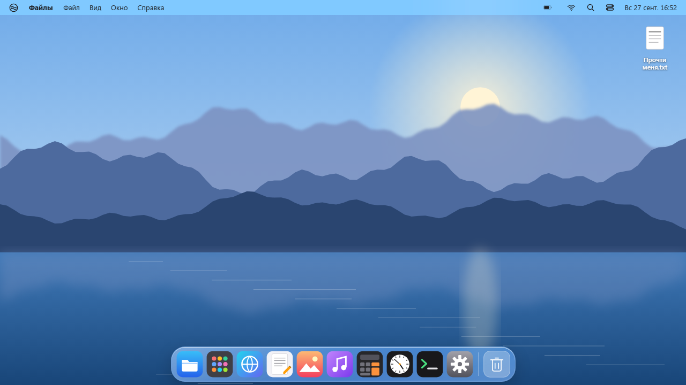
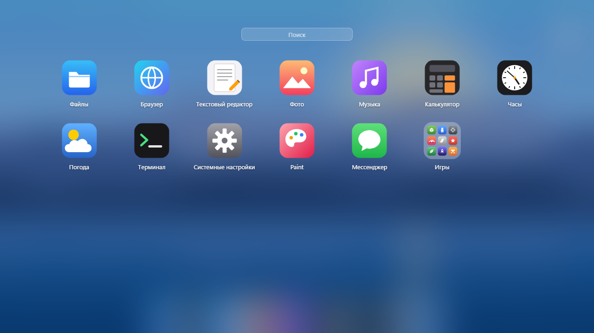
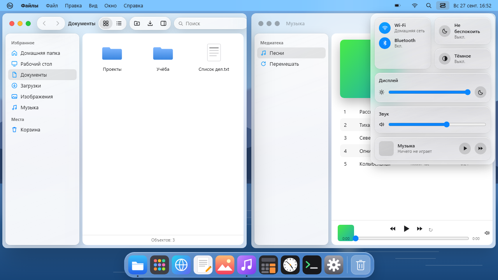

# MacOSDemo - "Tahoe" desktop

**English** · [Русский](README.ru.md)

"Tahoe" («Тахо») is a desktop in the spirit of macOS that runs entirely in the browser: a menu bar, a Dock, liquid glass, Mission Control, Launchpad, search and Control Center. No server, no internet, no images or fonts from the original system: icons and wallpapers are drawn by code in this repository.

**[▶ Open online](https://alexalesha.github.io/MacOSDemo/)**

> Fan-made interface concept. Not affiliated with or endorsed by Apple. macOS is a trademark of Apple Inc.

The interface is in Russian.







## What it does

- A menu bar with app menus, a Dock with magnification and minimised windows, window tiling at the screen edge and from the green button.
- Mission Control, Launchpad with a Games folder, search (Ctrl+Space), Control Center, notifications and a widget centre, a lock screen.
- Files are kept in the browser (IndexedDB); ten apps: Files, Browser, Text Editor, Photos, Music, Calculator, Clock, Weather, Terminal, System Settings, plus Paint and Messenger.
- Sheets instead of browser alerts; apps in the background are paused.
- **Games:** the ten games of the [GameRoom](https://github.com/ALEXalesha/GameRoom) collection
  open in a window: Cube World, Blockcity, Operation: Perimeter, Horizon Drift, Dino Run, Jump Jump,
  Hot Jungle, Space Gun, Falling Blocks and Sudoku. Each is its own repository: on GitHub Pages the
  window loads `../../<repository>/` of the same site (for example
  [AlexMine](https://alexalesha.github.io/AlexMine/)). Locally, clone the game repositories next to
  this one. A game in a minimised or inactive window is paused (the protocol is in
  `_os-shared/README.md`).


The desktop lives in `macos-tahoe/`; it is built from `macos-tahoe/src/` by `node macos-tahoe/src/build.js`. The root `index.html` just opens it.


## Run locally

Open `index.html` or `macos-tahoe/index.html` in Chrome or Edge.

## Tests

Playwright laws in `tests/` open the page by its file address in headless Chromium, one at a
time:

```
npm install
npx playwright install chromium
npm test
```

The tests for game windows run only when the game repositories lie next to this one; otherwise
they are skipped. Mouse capture in the tests is always a stub. The pictures above were made headless by the screenshot script of the GameRoom collection.

## History

"Tahoe" was made in the [GameRoom](https://github.com/ALEXalesha/GameRoom) collection (folders `web/macos-tahoe` and `web/_os-shared`), where it also opens from the Igroteka launcher. This repository carries it with its commit history, starting after the first raw import (it still had other companies' product names and texts); the start page, the games table for the separately published games and the tests were added for this publication.

## Licence

MIT, see [LICENSE](LICENSE).
